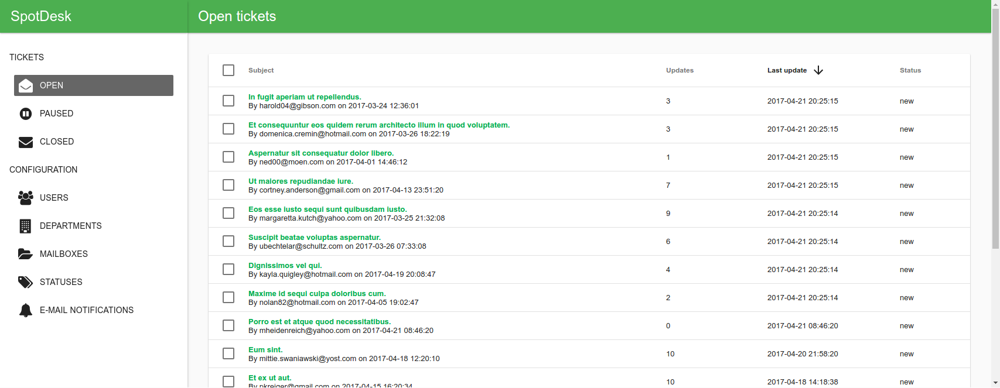
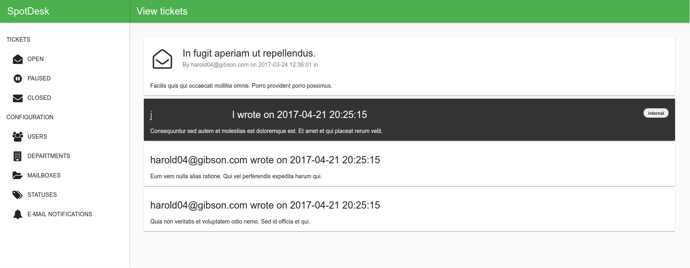

=================
SpotDesk Helpdesk
=================

Very basic e-mail based Helpdesk software. It reads from one or more mailboxes
and converts the e-mails into tickets. Those tickets can be sorted into
departments and can be responded to by SpotDesk users. It is also designed with
security and privacy in mind. This means among other things that no
dependencies may be loaded from sources outside where SpotDesk runs and that
users should be able to control their own data.

This project is based on my own `Middle framework <https://github.com/jschreuder/Middle>`_
and requires PHP 7.1. The frontend of the project is based on
`Angular Material <https://material.angularjs.org/>`_.

--------------
Project status
--------------

.. image:: https://scrutinizer-ci.com/g/jschreuder/SpotDesk/badges/quality-score.png?b=master
   :target: https://scrutinizer-ci.com/g/jschreuder/SpotDesk/?branch=master
   :alt: Scrutinizer Code Quality
.. image:: https://scrutinizer-ci.com/g/jschreuder/SpotDesk/badges/coverage.png?b=master
   :target: https://scrutinizer-ci.com/g/jschreuder/SpotDesk/?branch=master
   :alt: Scrutinizer Build Status
.. image:: https://scrutinizer-ci.com/g/jschreuder/SpotDesk/badges/build.png?b=master
   :target: https://scrutinizer-ci.com/g/jschreuder/SpotDesk/?branch=master
   :alt: Scrutinizer Build Status

Approaching beta status.

-----------
Screenshots
-----------

*Note: the data shown in the screenshots was generated with* `Faker <https://github.com/fzaninotto/Faker>`_

------------------------------
Features currently implemented
------------------------------

* JSON REST API backend
* Angular Material frontend
* E-mails from mailbox automatically turned into tickets or updates to existing
  tickets
* Ticket listing by status-type (open, paused or closed)
* Ticket viewing adding notes (private) and updates (visible to client) to them
* Tickets are categorized by department, and may be moved between them
* Clients receive updates to their ticket by e-mail
* User management: creating, deleting and changing their department assignments
* Department management: creating, updating and deleting
* **More to come...**
